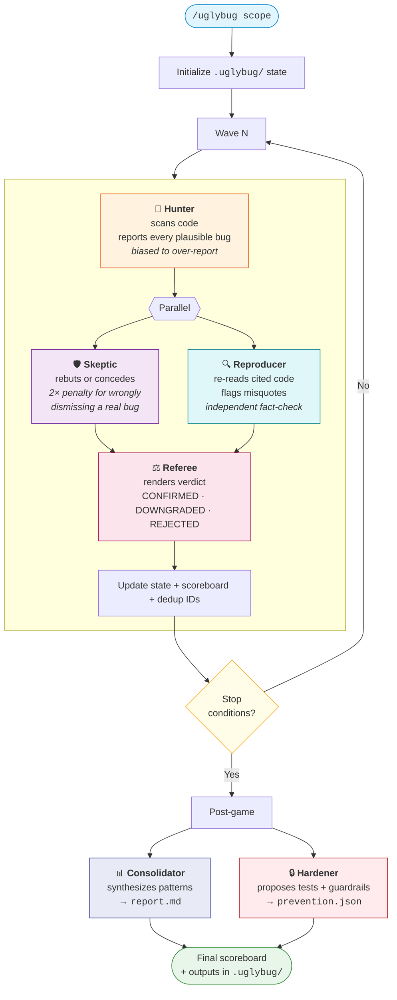

# /uglybug

[](https://github.com/mathifonseca/claude-uglybug/actions/workflows/ci.yml)
[](LICENSE)
[](https://claude.com/claude-code)
[](CONTRIBUTING.md)

Adversarial bug-hunt skill for [Claude Code](https://claude.com/claude-code). Six isolated agents find real bugs in your codebase through structured rebuttal, independent verification, and ruling.

## How it works



### The six agents

Each runs in a completely isolated context so no anchoring or sycophancy leaks between them:

**In-game** (runs every wave)
1. **Hunter** — scans the code and reports every plausible bug (biased to over-report)
2. **Skeptic** — tries to disprove each finding; **pays 2x penalty for wrongly dismissing a real bug** (asymmetric skin-in-the-game)
3. **Reproducer** — independently re-reads the cited code and flags misquotes (fact-check layer between Hunter and Skeptic)
4. **Referee** — renders the final verdict: `CONFIRMED`, `DOWNGRADED`, or `REJECTED`

**Post-game** (runs once at the end)

5. **Consolidator** — synthesizes all confirmed findings into systemic architectural patterns
6. **Hardener** — proposes concrete tests and guardrails to prevent each class of bug from recurring

Waves run until stop conditions are met (max waves reached, two consecutive clean waves, or the Hunter itself declares coverage exhausted). Findings, observations, and full per-wave agent outputs land in `.uglybug/` for inspection and replay.

## Credit & prior art

This skill is inspired by [@systematicls's article](https://x.com/systematicls/status/2028814227004395561) *"How To Be A World-Class Agentic Engineer,"* which describes a 3-agent adversarial bug-finding pattern — a Hunter that over-reports, an adversarial agent that tries to disprove each bug with an asymmetric scoring penalty, and a Referee that renders verdicts while being told it has the ground truth.

> *"I get a bug-finder agent to identify all the bugs ... I get an adversarial agent ... for every bug that the agent is able to disprove as a bug, it gets the score of that bug, but if it gets it wrong, it will get -2 × score of that bug ... Finally, I get a referee agent to take both their inputs and to score them. I lie and tell the referee agent that I have the actual correct ground truth."*
> — [@systematicls](https://x.com/systematicls/status/2028814227004395561)

A faithful 3-agent implementation of that pattern already exists at [danpeg/bug-hunt](https://github.com/danpeg/bug-hunt) — worth checking out if you want something closer to the original post.

## What's different here

This skill extends that pattern in four ways:

- **Six agents instead of three.** Adds an independent **Reproducer** that re-reads the cited code to catch misquotes before the Referee sees them, plus two **post-game** agents — **Consolidator** (pattern synthesis) and **Hardener** (concrete test + guardrail proposals) — so the session produces prevention artifacts, not just a list of bugs.
- **Multi-wave with dedup and auto-stop.** Findings from prior waves are passed forward so later waves don't re-surface the same bug. The game auto-terminates when signal degrades (two consecutive clean waves) rather than running on a fixed budget.
- **Counter-sycophancy as a stated design principle.** The 2x Skeptic penalty is grounded in published research — [SycEval (arXiv 2502.08177)](https://arxiv.org/abs/2502.08177) shows LLMs dismiss up to 88% of known vulnerabilities when code is framed as "bug-free." The scoring asymmetry is the structural counter-measure, not a detail.
- **Resumable + partially-invocable.** State persists in `.uglybug/`, so you can `--resume` a long session, or re-run a single role (e.g. `--role=hardener`) against existing findings without re-hunting.

## Install

```bash
git clone https://github.com/mathifonseca/claude-uglybug.git ~/.claude/skills/uglybug
```

Claude Code auto-discovers skills in `~/.claude/skills/`.

## Usage

```
/uglybug                               # hunt across the entire repo, up to 5 waves
/uglybug app/api                       # scope to one directory
/uglybug --waves=3 --theme=auth        # 3 waves, auth surface only
/uglybug --resume                      # continue from the last saved wave
/uglybug --role=hardener               # run Hardener against existing findings
/uglybug --no-consolidator             # skip post-game pattern synthesis
```

Outputs land in `.uglybug/`:

- `state.json` — full game state, scoreboard, findings, verdicts
- `wave-<n>-{hunter,skeptic,reproducer,referee}.json` — per-agent outputs
- `report.md` — final consolidated report
- `prevention.json` — Hardener's test + guardrail proposals

## Update

```bash
cd ~/.claude/skills/uglybug && git pull
```

## Uninstall

```bash
rm -rf ~/.claude/skills/uglybug
```

## Contributing

Contributions welcome — bug reports, prompt refinements, new heuristics, additional post-game agents. See [CONTRIBUTING.md](CONTRIBUTING.md).

## License

MIT — see [LICENSE](LICENSE).
